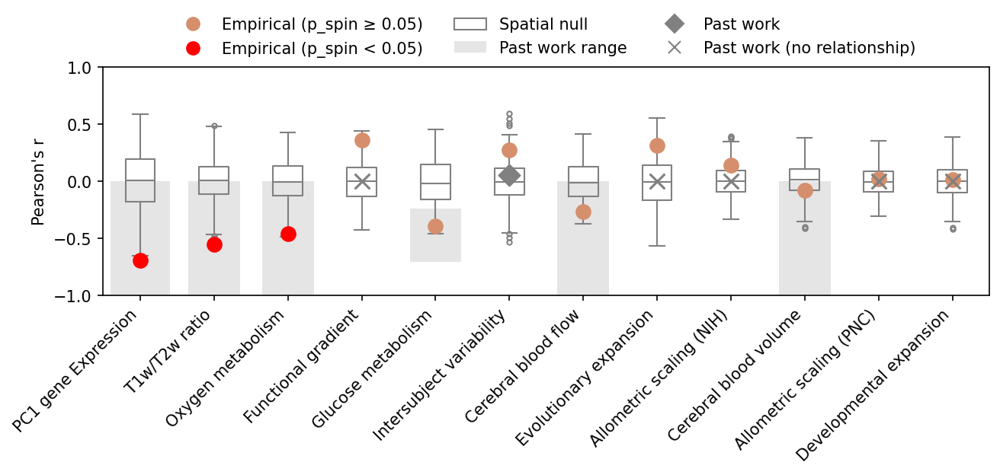

# Accounting for Spatial Autocorrelation in Brain Maps using Neuromaps

This repository reproduces the analytic workflow of Figure 4a from [Markello et al. (2022)](https://www.nature.com/articles/s41592-022-01625-w) using the [Neuromaps](https://netneurolab.github.io/neuromaps/usage.html) Python library.
It compares a cortical‐thickness map obtained from Human Connectome Project (HCP) S1200 release to multiple structural / functional / genetic brain maps by transforming surfaces, correlating them, applying spatial spin tests, correcting via FDR, and generating both surface figures and null-distribution boxplots.



## Data Source
The dataset contains cortical thickness measurements derived from T1-weighted MRI scans of 1,200 healthy young adults collected as part of the Human Connectome Project (HCP) S1200 release.
Cortical thickness is the distance between the pial (outer) and white matter (inner) surfaces of the brain’s cortex, a measure often associated with brain development, aging, and disease.
[More information here](https://www.humanconnectome.org/study/hcp-young-adult/document/1200-subjects-data-release)

## Repository Layout
Main files and purpose:
- `run.py` — main command-line script
- `configs/config.json` — global parameters (`seed`, `n_perm`, `out_dir`)
- `requirements.txt` — Python dependencies

Core modules `(src/brainmaps/)`:
- `config.py` — loads configuration settings
- `env.py` — checks environment and Workbench setup
- `helpers.py` — small utility functions
- `catalog.py` — defines which maps to fetch and plot
- `transforms.py` — converts brain maps between coordinate systems
- `stats.py` — computes correlations, spin tests, and FDR
- `plotting.py` — handles surface visualization
- `pipeline.py` — connects all processing steps


## Output Structure
All results are saved in the `out/ folder`:
- `correlations.csv` – Pearson correlation (r) and spin-test p-values
- `correlations_fdr.csv` – same as above, plus FDR-adjusted p-values
- `figs/` – generated brain map visualizations
   - `<map>.png` – each individual map
   - `boxplots.png` – null-distribution vs. empirical r summary figure

## Requirements
- Python requirement: Neuromaps works with Python 3.8 or higher.
- To effectively use neuromaps, you must have the Connectome Workbench installed and accessible on your system.
Many of neuromaps’ core functions depend on Workbench utilities such as `wb_command`.

Follow the official installation guide here: [Connectome Workbench Installation Instructions](https://www.humanconnectome.org/software/connectome-workbench)

After installation, verify that it’s available from your terminal:
```
wb_command -version
```
If this command prints a version number (e.g., `wb_command v1.5.0`), the Workbench is correctly installed and in your system PATH.


## Setup
### Clone and enter
```
1. git clone https://github.com/<yourname>/neuromaps-schizophrenia-thinning.git
2. cd neuromaps-schizophrenia-thinning
```

### Create virtualenv
```
3. python3 -m venv .venv
4. source .venv/bin/activate
5. pip install -r requirements.txt
```

On macOS, install Connectome Workbench and ensure `/Applications/Workbench/bin_macosx64` is in your PATH.

## Configuration
Edit `configs/config.json`:
- `out_dir` – output directory
- `seed` – random seed for reproducibility
- `n_perm` – number of spin-test permutations

## Run the Pipeline
| Step                      | Command                    | Description                                         |
| ------------------------- | -------------------------- | --------------------------------------------------- |
| Environment check         | `python run.py env`        | Verify neuromaps + Workbench availability           |
| Transform maps            | `python run.py transforms` | Fetch & transform all target maps                   |
| Correlations + spin tests | `python run.py stats`      | Saves `correlations.csv` and 1-D nulls              |
| FDR correction            | `python run.py fdr`        | Adds `p_fdr` column                                 |
| Surface plots             | `python run.py viz`        | Generates per-map figures                           |
| Boxplot                   | `python run.py results`    | Creates `figs/boxplots.png` using *p_spin*          |
| Full pipeline             | `python run.py all`        | Runs env → transforms → stats → fdr → viz → results |

You can delete old outputs anytime:
`rm -rf out/`

## Interpretation
- Red dots in `boxplots.png` = maps where `p_spin < 0.05` (significant correlation).
- Gray boxes = null distributions from spatial permutations.
- `correlations.csv` lists Pearson r and p_spin per target map.
- `correlations_fdr.csv` additionally provides p_fdr values for FDR-controlled significance.

## Citation
_Markello, R. D., Hansen, J. Y., Liu, Z.-Q., Bazinet, V., Shafiei, G., … Misic, B. (2022). neuromaps: structural and functional interpretation of brain maps. Nature Methods, 19(11), 1472–1479. https://doi.org/10.1038/s41592-022-01625-w_
